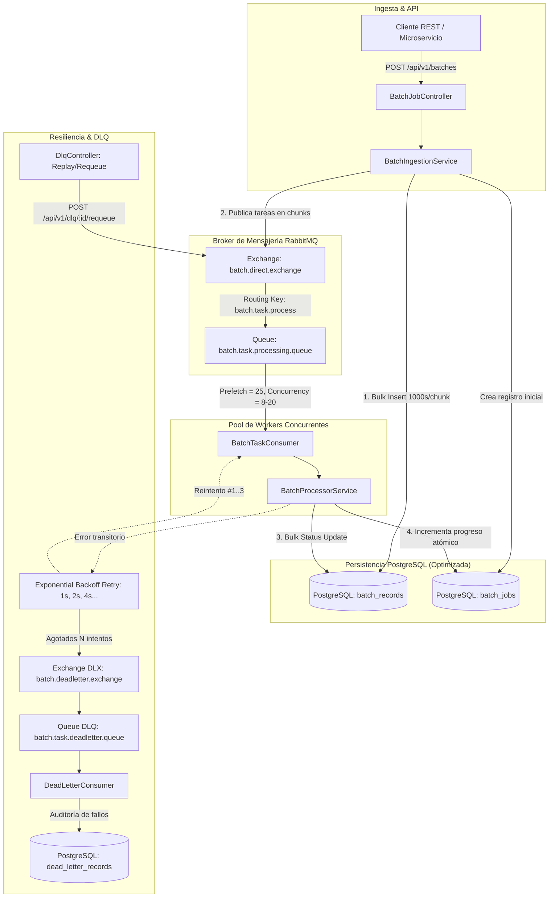

# 🚀 Batch Flow Engine (Motor de Tareas Asíncronas y Procesamiento por Lotes)

Un motor backend de alta capacidad, resiliente y concurrente diseñado para la ingesta masiva, particionamiento en chunks, distribución asíncrona mediante colas de mensajería (RabbitMQ), persistencia optimizada en PostgreSQL y tolerancia a fallos con reintentos exponenciales (**Exponential Backoff**) y **Dead Letter Queue (DLQ)**.

---

## 🏗️ Arquitectura del Sistema



---

## 🌟 Características Principales

1. **Desacoplamiento Total con RabbitMQ**:
   - Ingesta rápida con respuesta `202 Accepted` inmediata mientras los workers procesan en background.
   - Particionamiento configurable por chunks (ej. 200 registros por mensaje).
   - Concurrencia elástica de workers con control de *prefetch* para evitar saturación de memoria.

2. **Resiliencia Extrema y Dead Letter Queue (DLQ)**:
   - **Exponential Backoff**: Configuración de reintentos escalonados ($1\text{s} \to 2\text{s} \to 4\text{s} \to \dots \to 10\text{s}$).
   - **DLX / DLQ Automático**: Los mensajes que fallan tras $N$ reintentos son transferidos a la cola de mensajes muertos con sus headers de diagnóstico (`x-exception-message`, `x-exception-stacktrace`, `x-original-queue`, `retry-count`).
   - **API de Diagnóstico y Replay**: Endpoints para listar mensajes fallidos, inspeccionar la traza del error y reenviar las tareas a la cola principal con un solo clic.

3. **Persistencia PostgreSQL de Alto Rendimiento**:
   - **Inserciones por lotes (Batch Inserts)**: `BulkBatchRecordRepository` con `JdbcTemplate.batchUpdate` que agrupa 1,000 registros por round-trip a la base de datos.
   - **Índices Estratégicos**: Índices compuestos en `(batch_job_id, status)`, `(status, created_at)` e índice `GIN` sobre columnas `JSONB`.
   - **Control Transaccional**: Actualizaciones atómicas en `batch_jobs` evitando contención de bloqueos mediante contadores concurrentes.

4. **Infraestructura con Docker & Docker Compose**:
   - PostgreSQL 16 con parámetros optimizados de memoria (`shared_buffers`, `work_mem`, `wal_buffers`).
   - RabbitMQ 3.13 con consola de administración web habilitada.
   - Contenedor de la aplicación con compilación multi-stage basada en imágenes ligeras Alpine.

---

## 🛠️ Stack Tecnológico

- **Lenguaje**: Java 25 / 21 LTS
- **Framework**: Spring Boot 3.4.3
- **Mensajería**: Spring AMQP & RabbitMQ 3.13
- **Base de Datos**: PostgreSQL 16 con Flyway Migrations
- **Acceso a Datos**: Spring Data JPA & Spring JDBC Template
- **Documentación API**: OpenAPI 3 & Swagger UI
- **Métricas y Monitoreo**: Spring Boot Actuator & Prometheus
- **Pruebas**: JUnit 5, MockMvc, AssertJ

---

## 🚀 Inicio Rápido con Docker Compose

### 1. Clonar y Levantar Todo el Stack
```bash
docker compose up --build -d
```

### 2. Verificar Estado de los Servicios
```bash
docker compose ps
```

Los servicios quedarán disponibles en:
- **Batch Flow Engine REST API**: [http://localhost:8080](http://localhost:8080)
- **Documentación Swagger UI**: [http://localhost:8080/swagger-ui.html](http://localhost:8080/swagger-ui.html)
- **Consola RabbitMQ Management**: [http://localhost:15672](http://localhost:15672) (Usuario: `rabbitmq`, Contraseña: `rabbitmqpassword`)
- **Actuator Health & Metrics**: [http://localhost:8080/actuator/health](http://localhost:8080/actuator/health)
- **Base de Datos PostgreSQL**: `localhost:5432/batch_flow_db` (Usuario: `postgres`, Contraseña: `postgrespassword`)

---

## 📖 Guía de Endpoints de la API

### 1. Ingesta de Lote Personalizado
```bash
curl -X POST http://localhost:8080/api/v1/batches \
  -H "Content-Type: application/json" \
  -d '{
    "jobName": "Facturacion-Mensual-Q3",
    "chunkSize": 100,
    "taskType": "DATA_TRANSFORMATION",
    "items": [
      {
        "externalId": "CLI-001",
        "data": "{\"amount\": 150.50, \"currency\": \"USD\"}"
      },
      {
        "externalId": "CLI-002",
        "data": "{\"amount\": 890.00, \"currency\": \"USD\"}"
      }
    ]
  }'
```

### 2. Generar Lote Masivo Sintético (Benchmark & Stress Testing)
Genera automáticamente miles de registros particionados en chunks con porcentaje de fallas simulado:
```bash
curl -X POST http://localhost:8080/api/v1/batches/generate \
  -H "Content-Type: application/json" \
  -d '{
    "jobNamePrefix": "StressTest",
    "totalRecords": 5000,
    "chunkSize": 250,
    "failurePercentage": 5,
    "simulatedDelayPerRecordMs": 0
  }'
```

### 3. Consultar Estado y Progreso en Tiempo Real
```bash
curl -X GET http://localhost:8080/api/v1/batches/{jobId}
```
**Respuesta:**
```json
{
  "success": true,
  "data": {
    "id": "3fa85f64-5717-4562-b3fc-2c963f66afa6",
    "jobName": "StressTest-1771344000000",
    "status": "COMPLETED",
    "totalRecords": 5000,
    "processedRecords": 4750,
    "failedRecords": 250,
    "progressPercentage": 100.0,
    "chunkSize": 250,
    "startedAt": "2026-08-17T10:15:00Z",
    "completedAt": "2026-08-17T10:15:04Z",
    "durationMs": 4120
  }
}
```

### 4. Consultar Registros Individuales de un Lote
```bash
curl -X GET "http://localhost:8080/api/v1/batches/{jobId}/records?status=FAILED&page=0&size=20"
```

### 5. Inspeccionar la Dead Letter Queue (DLQ)
```bash
curl -X GET "http://localhost:8080/api/v1/dlq?resolved=false"
```

### 6. Reenviar/Reintentar Tarea desde la DLQ (Replay)
```bash
curl -X POST "http://localhost:8080/api/v1/dlq/{deadLetterId}/requeue?resetRetryCount=true"
```

### 7. Consultar Métricas Generales del Motor
```bash
curl -X GET http://localhost:8080/api/v1/metrics/engine
```

---

## 🧪 Ejecución de Pruebas Automatizadas

El proyecto incluye tests de integración que validan:
- Ingesta masiva de miles de registros y bulk insert en base de datos.
- Ejecución desacoplada de workers.
- Reintentos con exponential backoff ante fallos simulados y derivación a DLQ.
- Re-enrutamiento y resolución desde la DLQ.
- Controladores REST mediante MockMvc.

Para ejecutar la suite de pruebas localmente:
```bash
# En Windows (PowerShell)
.\gradlew.bat test

# En Linux / macOS
./gradlew test
```

---

## ⚙️ Variables de Configuración

| Variable | Descripción | Valor por Defecto |
|---|---|---|
| `SERVER_PORT` | Puerto HTTP de la aplicación | `8080` |
| `SPRING_DATASOURCE_URL` | URL de conexión PostgreSQL | `jdbc:postgresql://localhost:5432/batch_flow_db` |
| `SPRING_DATASOURCE_USERNAME` | Usuario de PostgreSQL | `postgres` |
| `SPRING_DATASOURCE_PASSWORD` | Contraseña de PostgreSQL | `postgrespassword` |
| `SPRING_RABBITMQ_HOST` | Host de RabbitMQ | `localhost` |
| `SPRING_RABBITMQ_PORT` | Puerto AMQP de RabbitMQ | `5672` |
| `WORKER_CONCURRENCY` | Hilos concurrentes mínimos de consumo | `8` |
| `WORKER_MAX_CONCURRENCY` | Hilos concurrentes máximos de consumo | `20` |
| `WORKER_PREFETCH` | Prefetch count por worker | `25` |
| `BATCH_DEFAULT_CHUNK_SIZE` | Tamaño por defecto del lote por chunk | `200` |
| `JDBC_BATCH_SIZE` | Lote de sentencias SQL JDBC por round-trip | `1000` |
| `BATCH_RETRY_MAX_ATTEMPTS` | Intentos máximos antes de DLQ | `3` |
| `BATCH_RETRY_INITIAL_INTERVAL`| Intervalo inicial de backoff (ms) | `1000` |
| `BATCH_RETRY_MULTIPLIER` | Multiplicador de backoff exponencial | `2.0` |
| `BATCH_RETRY_MAX_INTERVAL` | Intervalo máximo de backoff (ms) | `10000` |

---

## 🏛️ Estructura del Código Fuente

```
batch-flow-engine/
├── src/
│   ├── main/
│   │   ├── java/com/thinkcode/batch_flow_engine/
│   │   │   ├── amqp/                 # Producers & Consumers (Workers & DLQ)
│   │   │   │   ├── BatchTaskProducer.java
│   │   │   │   ├── BatchTaskConsumer.java
│   │   │   │   └── DeadLetterConsumer.java
│   │   │   ├── config/               # RabbitMQ, OpenAPI, Async & Retries
│   │   │   │   ├── RabbitMQConfig.java
│   │   │   │   ├── OpenApiConfig.java
│   │   │   │   └── AsyncConfig.java
│   │   │   ├── controller/           # REST API Endpoints
│   │   │   │   ├── BatchJobController.java
│   │   │   │   ├── DlqController.java
│   │   │   │   └── MetricsController.java
│   │   │   ├── domain/
│   │   │   │   ├── entity/           # JPA Entities (BatchJob, BatchRecord, DeadLetterRecord)
│   │   │   │   ├── enums/            # JobStatus, RecordStatus, TaskType
│   │   │   │   ├── model/            # AMQP Message payloads & update DTOs
│   │   │   │   └── repository/       # Repositories & BulkBatchRecordRepositoryImpl (JDBC)
│   │   │   ├── dto/                  # Requests & Responses
│   │   │   ├── exception/            # Global Exception Handler & Custom Errors
│   │   │   └── service/              # Batch Ingestion, Processing, DLQ & Metrics
│   │   └── resources/
│   │       ├── application.yml
│   │       └── db/migration/         # Flyway DDL & Optimized Indexes
│   └── test/                         # Integration & Unit Tests
├── Dockerfile                        # Multi-stage container build
├── docker-compose.yml                # PostgreSQL + RabbitMQ + App
├── .env.example
├── build.gradle
└── README.md
```
